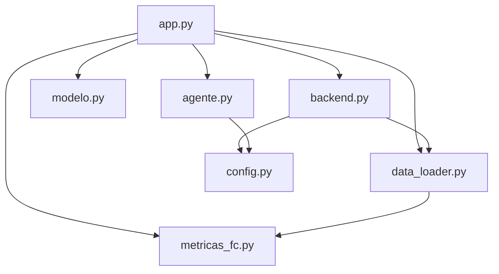

# Athletix

Sistema de información para el análisis de carga de entrenamiento a partir del historial
deportivo de Strava. Calcula indicadores de fatiga, estima el rendimiento en competición
mediante un modelo de regresión y expone un agente conversacional que interpreta esos
resultados sobre datos reales.

El proyecto nació como trabajo de la asignatura Fundamentos de Ciencia de Datos e
Inteligencia Artificial de la carrera de Ciencia de Datos e IA de la UNACH, y después se
extendió con persistencia en la nube, carga manual de frecuencia cardíaca y métricas
derivadas de series de pulso.

## Qué problema resuelve

Strava registra actividades pero no responde la pregunta que importa al entrenar, si la
carga acumulada de los últimos días es segura o si conduce a una lesión. Athletix parte
del historial exportado, reconstruye una serie diaria de carga y calcula el ratio entre
la carga aguda y la crónica, que es el indicador que la literatura asocia al riesgo de
lesión. Sobre esa base añade una estimación de rendimiento y un asistente que razona con
los indicadores en lugar de con impresiones.

## Arquitectura

El sistema se organiza en siete módulos con responsabilidades separadas. La capa de
presentación no calcula nada y la capa de cálculo no conoce Streamlit, de modo que el
análisis se puede ejecutar y probar sin levantar la interfaz.

| Módulo | Responsabilidad |
|---|---|
| `app.py` | Interfaz en Streamlit. Cinco pestañas de análisis y el chat del agente. |
| `backend.py` | Limpieza, normalización, cálculo de carga, ACWR y agregaciones. |
| `modelo.py` | Componente predictivo. Regresión por mesociclos y planificador inverso. |
| `agente.py` | Construcción del contexto del LLM y persistencia de la conversación. |
| `data_loader.py` | Adquisición desde la API de Strava y persistencia en Supabase. |
| `metricas_fc.py` | Funciones puras de análisis de series de frecuencia cardíaca. |
| `config.py` | Configuración compartida. Zona horaria y utilidades de fecha. |



`metricas_fc.py` existe como módulo aparte por una razón concreta. Las funciones de
análisis de series de pulso las necesitan tanto la capa de adquisición como la de
procesamiento, y alojarlas en cualquiera de las dos habría creado una dependencia
circular entre ambas. Al ser funciones puras, sin lectura ni escritura de datos, pueden
importarse desde las dos sin ciclo.

## Fuentes de datos

El sistema combina tres orígenes.

**Sincronización con la API de Strava.** Se autentica por OAuth 2.0 con un refresh token
y descarga las actividades posteriores a la última registrada mediante el parámetro
`after`. La paginación es de 200 elementos por página. La descarga se aplica sobre
Supabase con `upsert` sobre la columna `fecha_actividad`, que es única, de modo que el
solape de tres días que se aplica por seguridad no genera duplicados. Actualmente la
tabla contiene 1537 actividades, desde el 09/10/2020 hasta el 29/08/2026.

**Export histórico de Strava.** Archivo `actividades_strava.csv` con el volcado completo
de la cuenta. Contiene datos deportivos personales reales. Desde que la sincronización
cubre todo el historial, este archivo solo aporta las actividades anteriores al primer
registro descargado por la API.

**Carga manual de frecuencia cardíaca.** El reloj utilizado no exporta el pulso a Strava
en todas las actividades, por lo que la interfaz permite pegar la serie de tiempo y
pulsaciones transcrita desde la aplicación del dispositivo. Se guarda en una tabla propia
y rellena únicamente los huecos, sin sobrescribir el pulso que sí provee Strava.

## Modelo de datos

La persistencia usa PostgreSQL a través de Supabase. El sistema de archivos de Streamlit
Community Cloud es efímero, así que ningún estado se guarda en disco.

```sql
create table actividades_sincronizadas (
  id bigint generated always as identity primary key,
  fecha_actividad text not null unique,
  tipo_actividad text,
  distancia_m double precision,
  tiempo_movimiento_s double precision,
  tiempo_transcurrido_s double precision,
  desnivel_positivo_m double precision,
  fc_promedio double precision,
  velocidad_promedio double precision
);

create table fc_manual (
  id bigint generated always as identity primary key,
  fecha_actividad text not null,
  tiempo_s integer not null,
  fc_ppm integer not null,
  unique (fecha_actividad, tiempo_s)
);

create table historial_chat (
  id bigint generated always as identity primary key,
  rol text not null,
  contenido text not null,
  creado_en timestamptz not null default now()
);

create table diario_estado (
  fecha date primary key,
  estado text not null,
  nota text default ''
);
```

Dos decisiones del esquema conviene justificarlas.

La frecuencia cardíaca manual vive en una tabla separada y no como columnas de
`actividades_sincronizadas`. La razón es que `upsert` reemplaza la fila completa, así que
una sincronización posterior borraría en silencio el pulso introducido a mano. Al
separarlas, `actividades_sincronizadas` se comporta como un espejo de Strava que se puede
sobrescribir sin riesgo, y ambas se combinan al leer.

La tabla `fc_manual` guarda una fila por muestra en lugar de la serie completa en un campo
`jsonb`. El modelo normalizado representa la relación uno a muchos entre una actividad y
sus muestras, y permite consultar y agregar el pulso con SQL. El costo son entre 200 y 500
filas por actividad, irrelevante frente a los 500 MB del plan gratuito.

La misma tabla no declara llave foránea hacia las actividades. Los registros están
repartidos entre el CSV del repositorio y Supabase, de modo que una restricción de
integridad rechazaría cualquier serie asociada a una actividad histórica. Se sacrifica
integridad referencial a cambio de cobertura, y el precio es que una clave mal escrita
produce muestras huérfanas en vez de un error.

## Indicadores implementados

**Carga de entrenamiento.** Se calcula como TRIMP simplificado, el producto de la duración
en movimiento por la frecuencia cardíaca media dividido entre 100. El 60 % del historial
no tiene pulso registrado, y rellenarlo con la media global falsearía la mayor parte del
conjunto. En esas sesiones la carga se estima a partir de la duración escalada por el
factor mediano de carga por minuto observado en el mismo deporte. La duración empleada es
siempre la de movimiento, porque el tiempo detenido no genera fatiga.

**ACWR.** Cociente entre la carga media de los últimos 7 días y la de los últimos 28. Se
calcula sobre una serie diaria continua, con ceros en los días de descanso, porque el
indicador se define sobre ventanas de días y no sobre las últimas N actividades. Los
umbrales de referencia son 0.8, 1.3 y 1.5, según Gabbett (2016). El diagnóstico se
calcula siempre con todos los deportes juntos, ya que el organismo acumula una sola
fatiga y separar la carga por disciplina produciría diagnósticos contradictorios.

**Predicción de rendimiento.** Regresión lineal múltiple entrenada sobre bloques de 28
días. Se usan mesociclos y no semanas porque el descanso previo a una competición sesgaría
el modelo hacia tiempos más lentos. La validación es Leave One Out, y la interfaz reporta
el coeficiente de determinación, el error absoluto medio y la mejora frente a predecir
siempre el ritmo medio. La proyección a distancias fuera del rango calibrado se corrige
con la fórmula de Riegel y se advierte de forma explícita en pantalla.

**Planificador de mesociclo.** El mismo modelo se invierte para despejar el volumen
semanal necesario para alcanzar una marca objetivo. Si el incremento exigido supera el
10 % semanal, la interfaz lo señala como riesgo por coherencia con los umbrales del ACWR.

**Zonas de intensidad y TRIMP de Edwards.** Sobre las series de pulso cargadas a mano se
reparte la duración en cinco zonas por porcentaje de la frecuencia cardíaca máxima, y se
calcula el TRIMP de Edwards (1993) ponderando los minutos de cada zona por un
multiplicador de 1 a 5.

**Media ponderada por tiempo.** El trazado manual produce muestras a intervalos
irregulares, así que un promedio aritmético sobrepondera los tramos con más muestras. La
media se obtiene integrando el pulso respecto al tiempo por regla del trapecio y
dividiendo entre la duración total.

**Deriva cardíaca.** Compara el pulso medio de la segunda mitad de la sesión con el de la
primera. Se acompaña de la variabilidad relativa del pulso, y por encima del 8 % la
interfaz advierte que el esfuerzo no fue continuo y que el valor no es interpretable.

## Agente conversacional

El agente usa la API de Anthropic con el modelo `claude-haiku-4-5`. No opera como un
chatbot aislado, recibe un contexto construido con la salida real de los módulos
analíticos, que incluye el ACWR y su interpretación, los volúmenes de 7 y 28 días, la
cobertura de pulsómetro, el detalle de las cinco últimas actividades con desnivel y tiempo
total, la predicción del modelo con su fiabilidad declarada y el diario de estado físico.

El prompt le prohíbe inventar datos que no aparezcan en ese contexto y le indica priorizar
el estado declarado por el deportista sobre los indicadores numéricos. La fecha actual se
inyecta de forma explícita, porque un modelo de lenguaje no tiene reloj y la deduciría mal.
La conversación se persiste en Supabase y sobrevive al cierre de la aplicación.

## Instalación

Requiere Python 3.11 o superior, una cuenta de Strava con aplicación registrada, un
proyecto de Supabase y una clave de la API de Anthropic.

```bash
git clone https://github.com/arieljmnz11/athletix.git
cd athletix
python -m venv .venv
.venv\Scripts\activate
pip install -r requirements.txt
```

Se crea un archivo `.env` en la raíz con las seis credenciales:

```
ANTHROPIC_API_KEY=
STRAVA_CLIENT_ID=
STRAVA_CLIENT_SECRET=
STRAVA_REFRESH_TOKEN=
SUPABASE_URL=
SUPABASE_KEY=
```

`SUPABASE_KEY` debe ser la clave secreta de servicio, no la publicable. Las tablas se
crean ejecutando el bloque SQL de la sección de modelo de datos en el editor de Supabase.
La aplicación se levanta con `streamlit run app.py`.

## Despliegue

La aplicación está desplegada en Streamlit Community Cloud, conectada a la rama `main` del
repositorio. Las seis credenciales se cargan en la sección Secrets del panel, sin agrupar
bajo ninguna cabecera, de forma que Streamlit las exponga como variables de entorno y
`os.getenv` siga funcionando igual que en local.

Un detalle operativo que conviene tener presente. Cuando un push modifica un módulo
distinto de `app.py`, Streamlit vuelve a ejecutar el guion pero reutiliza los módulos ya
importados en `sys.modules`, de modo que los cambios no se aplican. En ese caso hay que
usar la opción Reboot app del panel para forzar la reimportación.

## Limitaciones conocidas

Se documentan de forma explícita porque condicionan la interpretación de los resultados.

**Origen del pulso manual.** Las series no provienen de un archivo exportado por el
dispositivo, sino de transcribir el gráfico de la aplicación del reloj. El muestreo es
irregular, con tramos de pocos segundos entre muestras y huecos de varios minutos que se
interpolan de forma lineal. En la serie del 20/08/2026 hay un vacío de casi tres minutos
donde el pulso real se desconoce.

**Frecuencia cardíaca máxima de referencia.** Las zonas y el TRIMP de Edwards dependen por
completo de este valor. Por defecto se propone el máximo observado en las series ya
cargadas, que casi con seguridad queda por debajo del máximo fisiológico real, ya que solo
refleja los esfuerzos transcritos. El campo se puede corregir a mano en la interfaz.

**El TRIMP de Edwards no alimenta el ACWR.** El ratio agudo crónico solo tiene sentido si
numerador y denominador comparten escala. Como únicamente unas pocas sesiones tienen serie
completa de pulso, aplicar Edwards a ellas mezclaría dos escalas en el mismo histórico. Se
muestra por sesión como métrica complementaria y la columna de carga permanece sin cambios.

**Ritmo en terreno de montaña.** El ritmo se calcula sobre distancia horizontal, así que en
salidas con desnivel alto no refleja el esfuerzo real. Por eso el contexto del agente
incluye el desnivel positivo y el tiempo transcurrido, y le indica interpretar esas
sesiones sin apoyarse solo en el ritmo.

**Husos horarios de las dos fuentes.** El export de Strava fecha las actividades en UTC y
la API las entrega en hora local, de modo que una misma actividad no coincide entre ambas
y se contabilizaba dos veces. La sincronización cubre ya todo el historial, así que la API
se toma como fuente autoritativa y el CSV solo aporta lo anterior a su primer registro.

**Actividades con la misma hora de inicio.** La clave única de la tabla es
`fecha_actividad`, pero Strava admite dos actividades que empiecen en el mismo instante.
En ese caso se conserva una sola. La clave verdaderamente única sería el identificador de
Strava, que no se está almacenando.

**Suspensión por inactividad.** Tanto el proyecto de Supabase como la aplicación de
Streamlit Community Cloud se suspenden tras varios días sin uso. No hay pérdida de datos,
pero la primera visita después de un periodo largo requiere reactivarlos.

## Referencias

Edwards, S. (1993). *The Heart Rate Monitor Book*. Polar Electro Oy.

Gabbett, T. J. (2016). The training injury prevention paradox: should athletes be training
smarter and harder? *British Journal of Sports Medicine*, 50(5), 273-280.

Riegel, P. S. (1981). Athletic records and human endurance. *American Scientist*, 69(3),
285-290.
